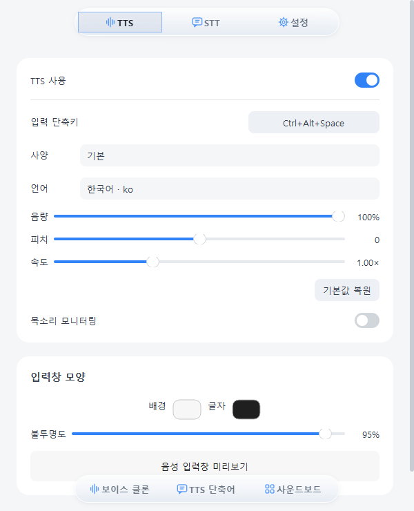

# STTS

Discord 실시간 자막과 텍스트 음성 전송을 위한 데스크톱 앱.

[다운로드](https://github.com/NONO6202/STTS/releases/latest) · [Windows 사용법](Windows/README.md) · [소스 빌드](docs/build.md)

## 기능

- **실시간 자막** — Discord에서 들리는 음성을 자막으로 표시합니다.
- **텍스트 음성 전송** — 입력한 문장을 가상 마이크로 보냅니다.
- **보이스 클론** — 3~30초 음성으로 목소리를 등록합니다.
- **단축키·단축어** — 입력창 호출과 자주 쓰는 문장을 설정합니다.
- **로컬 모델** — Whisper, Qwen3-TTS, Supertonic을 기기에서 실행합니다.

## 다운로드

| 운영체제 | 요구 사항 | 설치 |
| --- | --- | --- |
| Windows | Windows 10 22H2 이상 / 11, x64 | [Windows EXE](https://github.com/NONO6202/STTS/releases/download/v0.1.3/STTS-0.1.3-setup-x64.exe) |
| macOS | macOS 26+, Apple Silicon | [macOS DMG](https://github.com/NONO6202/STTS/releases/download/v0.1.3/STTS-0.1.3-arm64.dmg) |

Windows 설치 파일에 실행 환경과 VB-CABLE 드라이버가 포함됩니다. 모델은 첫 사용 시 자동으로 다운로드합니다.

macOS는 DMG로 설치하거나 앱에서 업데이트할 수 있습니다.

## 시작하기

1. STTS를 설치하고 실행합니다. Windows에서 가상 마이크를 처음 설치했다면 PC를 재시작합니다.
2. Discord **설정 → 음성 및 비디오 → 입력 장치**를 선택합니다.
   - Windows: **STTS (VB-Audio Virtual Cable)**
   - macOS: **STTS Microphone**
3. **TTS**를 켜고 입력 단축키로 문장을 보냅니다. **STT**를 켜면 수신 음성이 자막으로 표시됩니다.

Discord 출력 장치는 평소 사용하는 헤드폰이나 스피커를 선택합니다. Windows의 **설정 → 가상 마이크 연결 점검**에서 케이블 상태와 음량을 확인할 수 있습니다.

## 모델과 데이터

Windows는 미리 양자화된 INT8 모델을 다운로드합니다. 일부 임베딩·코덱은 원본 정밀도를 사용합니다. [모델 구성과 다운로드 용량](docs/models.md)

음성·대본·모델은 기기에 저장됩니다. 로컬 모델은 기기에서 추론하며, **기본 TTS인 gTTS는 입력 문장을 Google에 전송**합니다.

## 라이선스

[MIT](LICENSE). 외부 모델·라이브러리·VB-CABLE에는 각각의 라이선스가 적용됩니다.

[외부 구성요소](Support/THIRD_PARTY.md) · [VB-CABLE 고지](Windows/VB-CABLE-NOTICE.txt)
