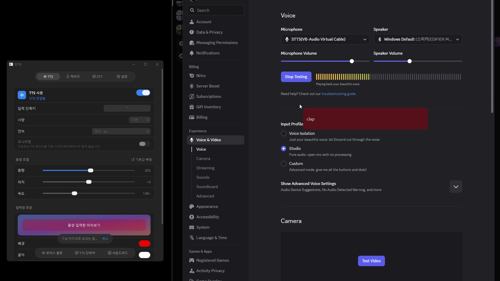

# STTS

게임을 끄지 않고 보이스 채팅에서 말하는 데스크톱 앱. 단축키로 입력창을 띄워 문장을 입력하면 가상 마이크로 Discord 등 음성 채팅에 말해 주고, 상대의 말은 실시간 자막으로 보여 줍니다.

[Windows 사용법](Windows/README.md) · [소스 빌드](docs/build.md)

## 기능

- **게임 중 바로 입력** — 단축키를 누르면 화면 위에 입력창이 뜹니다. Enter로 보내고, 마우스를 흔들면 닫힙니다. 창 모드와 테두리 없는 전체 화면 게임에서 사용할 수 있습니다.
- **텍스트 음성 전송** — 입력한 문장을 가상 마이크로 보냅니다.
- **실시간 자막** — 보이스 채팅에서 들리는 음성을 자막으로 표시합니다.
- **보이스 클론** — 3~30초 음성으로 목소리를 등록합니다.
- **단축키·단축어** — 입력창 호출, 자주 쓰는 문장과 입력 자동완성을 설정합니다.
- **사운드보드** — 저장한 소리를 재생하거나 이름을 입력해 전송합니다. 단축어와 이름이 겹치지 않게 저장합니다.
- **음성 조절** — 음량·피치·속도를 조절하고 기본값으로 복원합니다.
- **마이크 효과** — 실제 마이크 목소리에 피치와 전화·로봇·에코 등 효과를 적용해 함께 보냅니다.
- **로컬 모델** — Whisper, Qwen3-TTS, Supertonic을 기기에서 실행합니다.

## 배포

GitHub는 소스 코드 공개용입니다. 바로 실행할 수 있는 Windows·macOS 빌드와 자동 업데이트는 Steam에서 제공할 예정입니다. 직접 [소스 빌드](docs/build.md)해서 무료로 사용할 수도 있습니다.

| 운영체제 | 요구 사항 |
| --- | --- |
| Windows | Windows 10 22H2 이상 / 11, x64 |
| macOS | macOS 26+, Apple Silicon |

Windows판에는 실행 환경과 VB-CABLE 드라이버가 포함되며, 첫 실행 때 관리자 승인 한 번으로 가상 마이크를 설치합니다. 모델은 첫 사용 시 자동으로 다운로드합니다.

소스로 빌드한 앱은 자동 업데이트가 없으므로 최신 소스로 다시 빌드합니다.

## 시작하기

1. STTS를 실행합니다. Windows에서는 처음 실행할 때 **가상 마이크 설치**를 눌러 관리자 권한을 승인합니다.
2. Discord **설정 → 음성 및 비디오 → 입력 장치**를 선택합니다.
   - Windows: **STTS (VB-Audio Virtual Cable)**
   - macOS: **STTS Microphone**
3. **TTS**를 켜고 입력 단축키로 문장을 보냅니다. **STT**를 켜면 수신 음성이 자막으로 표시됩니다.

Discord 입력 장치 목록에 STTS가 보이지 않으면 Discord나 PC를 다시 시작합니다.

Discord 출력 장치는 평소 사용하는 헤드폰이나 스피커를 선택합니다. Windows의 **설정 → 가상 마이크 연결 점검**에서 케이블 상태와 음량을 확인할 수 있습니다.

## 모델과 데이터

Windows는 미리 양자화된 INT8 모델을 다운로드합니다. 일부 임베딩·코덱은 원본 정밀도를 사용합니다. [모델 구성과 다운로드 용량](docs/models.md)

음성·대본·모델은 기기에 저장됩니다. 로컬 모델은 기기에서 추론하며, **기본 TTS인 gTTS는 입력 문장을 Google에 전송**합니다.

## 라이선스

[PolyForm Strict 1.0.0](LICENSE)과 방송 허용 추가 조항이 적용됩니다.

- 개인·비상업 목적으로 무료로 사용하고, 소스를 그대로 빌드해 쓸 수 있습니다.
- STTS를 사용한 방송·영상·팟캐스트 제작과 수익 창출은 허용됩니다.
- 수정, 재배포, 판매, 그 밖의 상업적 이용은 허락이 필요합니다. [이슈](https://github.com/NONO6202/STTS/issues)로 문의하세요.
- 2026년 10월 1일 이전에 공개된 버전은 MIT 라이선스로 배포되었습니다.

외부 모델·라이브러리·VB-CABLE에는 각각의 라이선스가 적용됩니다.

[외부 구성요소](Support/THIRD_PARTY.md) · [VB-CABLE 고지](Windows/VB-CABLE-NOTICE.txt)
